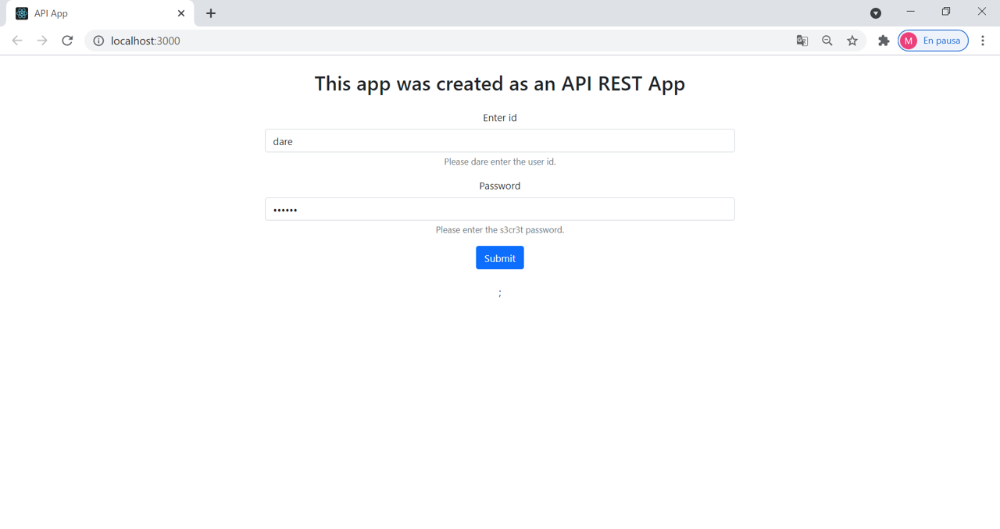
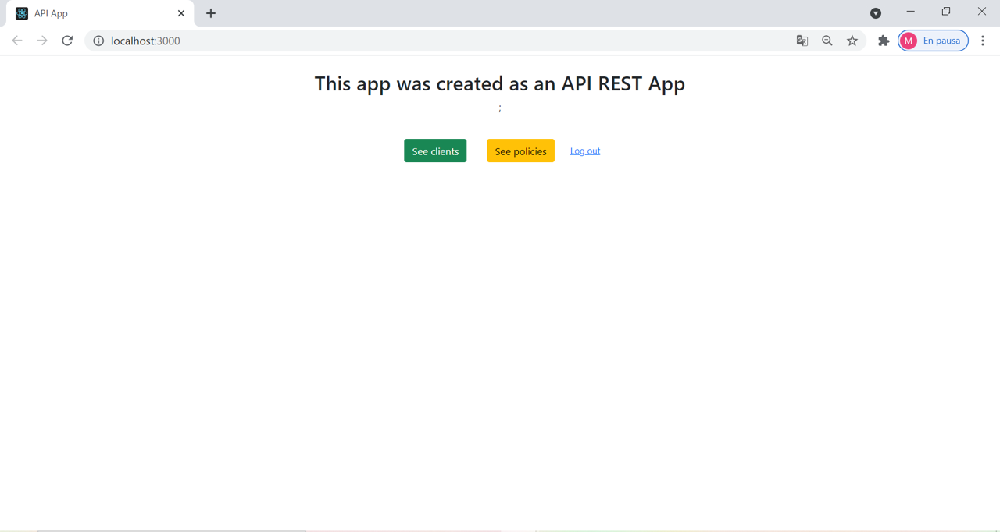

### dare-assessment

NodeJs API REST Assessment, created with a React Frontend

## Getting started

Before you run this app, please enter to the url shown below and CLICK Request temporary access to Demo server button.

https://cors-anywhere.herokuapp.com/corsdemo

You will have temporary access to the demo server.

Clone the repository to your computer.

Open the project directory inside the Terminal;
Make sure the packages are installled in yout local computer by running:

-npm install

To get started and open the app in your browser you can run:

-npm start

Runs the app in the development mode. 
Open [http://localhost:3000](http://localhost:3000) to view it in the browser.
Clone this git repository into your device to run in localhost.

## Technologies

This project is currently fullstack and was created using:
-Languages: Javascript, HTML
-Styling: CSS, Bootstrap
-Framework: ReactJS
-Webpack: NodeJS, Express, Axios

Here's a quick Visual.

 

 
